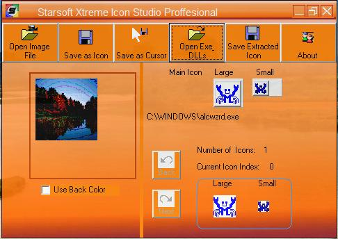



## Starsoft Xtreme Icon Studio Pro 2008

### Description

Starsoft Xtreme Icon Studio is the last word for Icon creation.

a highly graphicialized &amp; skinned tool for icon creation and extraction.

You can create icons from image files and also extract icons from exe's and dll,s. 

----

 
### More Info
 

             |
---                |---
**Submitted On**   |2008-04-16 18:58:44
**By**             |[Ajin Abraham](https://github.com/Planet-Source-Code/PSCIndex/blob/master/ByAuthor/ajin-abraham.md)
**Level**          |Advanced
**User Rating**    |4.2 (21 globes from 5 users)
**Compatibility**  |VB 4\.0 \(32\-bit\), VB 5\.0, VB 6\.0
**Category**       |[Graphics](https://github.com/Planet-Source-Code/PSCIndex/blob/master/ByCategory/graphics__1-46.md)
**World**          |[Visual Basic](https://github.com/Planet-Source-Code/PSCIndex/blob/master/ByWorld/visual-basic.md)
**Archive File**   |[Starsoft\_X2110144202008\.zip](https://github.com/Planet-Source-Code/ajin-abraham-starsoft-xtreme-icon-studio-pro-2008__1-70438/archive/master.zip)

